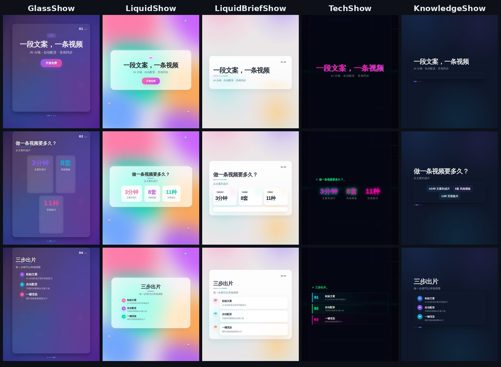
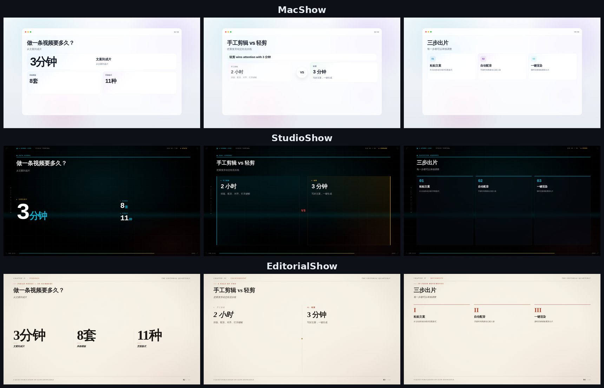
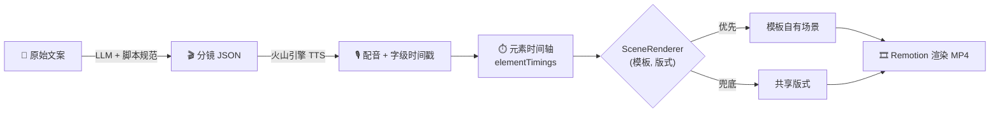

<div align="center">


# 轻剪 · Remotion Pro

### 写好一段文案，剩下的交给它。

**AI 拆分镜 → 自动配音 → 字级音画同步 → 一键出片**<br/>
开源的中文知识类短视频生成器，基于 Remotion，提供桌面客户端和命令行两种用法。

<p>
  <a href="https://github.com/CheeMao/remotion-pro/stargazers"></a>
  
  
  
  
  
</p>

<a href="#-快速开始">快速开始</a> ·
<a href="#-模板画廊">模板画廊</a> ·
<a href="#-它是怎么做到的">工作原理</a> ·
<a href="#%EF%B8%8F-桌面客户端">桌面客户端</a> ·
<a href="#-参与贡献">参与贡献</a>

<br/><br/>


<sub>↑ <b>同一份</b> <code>content.json</code>，5 套模板同时渲染。以上画面全部由代码生成，没有经过任何手工剪辑。</sub>

</div>

<br/>

## ✨ 为什么选择轻剪

做一条一分钟的干货短视频，真正花时间的不是想内容，而是**把内容变成画面**：逐页排版、录配音、对齐口播、打关键帧、导出。改一个字，可能要从头返工。

轻剪把这件事变成了一条流水线：

<table>
<tr>
<td width="50%" valign="top">

### 🧠 AI 当导演
粘贴一段文案，AI 自动拆成分镜，并为每一页挑选合适的版式：数据页、对比页、步骤页、时间线……内置[短视频脚本规范](docs/AI_CONTENT_PROMPT.md)，写出来的是有开头钩子、有节奏的**视频脚本**，而不是 PPT 大纲。

</td>
<td width="50%" valign="top">

### 🎙️ 念到哪，动到哪
火山引擎 TTS 返回**每个字的时间戳**，页面上的数字、要点、关键词会在口播念到它的那一刻才入场。这是手工剪辑中最费时、也最能提升观感的一步，在这里全自动完成。

</td>
</tr>
<tr>
<td width="50%" valign="top">

### 🎨 一键换风格
8 套模板共享同一套内容协议和 11 种版式。**内容写一次，风格随便换**，改一个字段重新渲染即可。每套模板都有独立的构图和动画语言，不只是换个配色。

</td>
<td width="50%" valign="top">

### 📄 视频即代码
一条视频就是一份 JSON：可以用 Git 管理，可以批量生成，也可以直接让 ChatGPT、Claude 等大模型来写。这是剪辑软件做不到的。

</td>
</tr>
</table>

| | 传统剪辑 | 轻剪 |
| --- | --- | --- |
| 排版 | 逐页手动摆放 | AI 自动选版式 |
| 配音 | 录音或外包，再手动对齐 | 自动合成，自动对齐 |
| 元素动画 | 逐个打关键帧 | 按口播时间自动入场 |
| 换风格 | 重做一遍 | 改一个字段 |
| 改一句文案 | 重新剪一段 | 重新渲染 |

## 🖼 模板画廊

**竖屏 1080×1920**：适合抖音、视频号、小红书、快手



**横屏 1920×1080**：适合 B 站、YouTube、课程与汇报



<sub>以上所有截图均由 <a href="examples/readme-demo.json"><code>examples/readme-demo.json</code></a> 这一份内容渲染而来。</sub>

| 模板 | 风格 | 推荐内容 |
| --- | --- | --- |
| `GlassShow` | 毛玻璃 · 深紫渐变 | 产品介绍、知识分享 |
| `LiquidShow` | macOS 液态玻璃 · 流动彩色 | 工具推荐、效率技巧 |
| `LiquidBriefShow` | 液态玻璃简报 · 浅色 | 快讯、要点速览 |
| `TechShow` | 终端 + 霓虹全息 | AI、科技、数码 |
| `KnowledgeShow` | 深蓝灰知识卡 | 科普、概念解释 |
| `MacShow` | Mac 应用窗口 · 横屏 | 教程、产品演示、复盘 |
| `StudioShow` | 演播室信息墙 · 横屏 | 汇报、策略拆解、数据讲解 |
| `EditorialShow` | 杂志排版 · 横屏 | 观点表达、案例拆解、品牌故事 |

所有模板共享同一套 11 种版式：`hero` 封面 · `default` 要点 · `steps` 步骤 · `compare` 对比 · `stats` 数据 · `quote` 金句 · `list` 卡片 · `chart` 图表 · `timeline` 时间线 · `highlight` 关键词 · `cta` 结尾引导。

## 🚀 快速开始

> 需要 Node.js 18+。配音功能需要一个[火山引擎语音合成](https://console.volcengine.com/speech/app/)账号，个人即可申请。

```bash
git clone https://github.com/CheeMao/remotion-pro.git
cd remotion-pro
npm install
npm run dev     # 打开 http://localhost:32123 ，所有模板都能直接预览
```

**生成第一条带配音的视频**：

```bash
cp .env.example .env    # 填入 VOLCENGINE_APP_ID / VOLCENGINE_ACCESS_KEY

npm run generate -- examples/readme-demo.json -t GlassShow -o out/demo.mp4
npm run generate -- examples/readme-demo.json -t TechShow  -o out/demo-tech.mp4   # 同一份内容，换个风格
```

### 内容长这样

你只需要写**文字**和**口播**。页面时长、音频起止时间、每个元素的入场时机都由流水线自动计算。

```jsonc
{
  "meta": { "title": "轻剪：一段文案，一条视频", "template": "GlassShow" },
  "slides": [
    {
      "layout": "stats",
      "title": "做一条视频要多久？",
      "data": {
        "stats": [
          { "value": 3,  "suffix": "分钟", "label": "文案到成片" },
          { "value": 8,  "suffix": "套",   "label": "风格模板" }
        ]
      },
      "narration": "从文案到成片，三分钟。八套风格模板……"
    }
  ]
}
```

口播念到"三分钟"时，`3分钟` 这张卡片才会弹出来。

## 🧩 它是怎么做到的



核心设计是**内容协议统一、版式集合共享、模板只负责视觉**。所以：

- AI 只需要学会**一种** JSON 结构，就能驱动所有模板；
- 新增一个模板，只要实现 11 个版式场景，就能立刻渲染所有已有内容；
- AI 输出不完美也没关系：内置 JSON 修复和字段规范化（如 `cover → hero`、`cards → list`）。

深入了解请阅读 [`docs/IMPLEMENTATION_LOGIC.md`](docs/IMPLEMENTATION_LOGIC.md)。

## 🖥️ 桌面客户端

不想碰命令行？**轻剪桌面版**（Tauri v2 + React + Arco Design）面向普通创作者：

- 📋 粘贴文案，或输入**抖音链接**自动提取原视频文案作为参考
- 🤖 接入任意 **OpenAI 兼容接口**（DeepSeek、通义、Kimi、OpenAI……），AI 一键生成分镜
- ✏️ 在编辑器中逐页修改，通过 `@remotion/player` **实时预览**
- 🎙️ 一键配音、一键渲染，**内置 Chromium**，无需另装环境
- 🔓 完全本地运行，无需注册登录，只需配置自己的 API Key

```bash
cd app && npm install && cd ..
npm run tauri:dev       # 开发模式
npm run tauri:build     # 打包安装包
```

## 📚 参考

<details>
<summary><b>命令行完整用法</b></summary>

```bash
# 完整流水线：配音 + 时间轴 + 渲染
npm run generate -- <content.json> [-t 模板] [-v 音色ID] [-r 语速] [-o 输出] [--skip-audio]

# 只生成逐页配音
npm run generate:audio -- <content.json> [-v 音色ID] [-r 1.0] [-o public/audio]

# 把纯文字分镜结构化为 layout + 默认 elementTimings
npm run generate:structure -- <content.json> [-t 模板]

# 从文本生成整段旁白 / 分段旁白时间轴
npx tsx src/cli/index.ts narrate <text-file> [-v 音色ID]
npx tsx src/cli/index.ts narrate-timeline <text-file> [-v 音色ID]

# 把已有音频的时间轴同步到 content.json
npx tsx src/cli/index.ts timeline <content.json> -s public/audio/narration.mp3

# 仅渲染（内容已包含时间信息）
npx tsx src/cli/index.ts render <content.json> [-t 模板] [-o out/video.mp4]
```

支持**整段旁白**（一条音轨，每页标注起止时间）和**逐页配音**（每页独立音频，渲染时拼接）两种模式。TTS 结果按内容哈希缓存在 `audio-cache/`，改文案只会重新合成改动过的部分。

</details>

<details>
<summary><b>环境变量</b></summary>

| 变量 | 说明 |
| --- | --- |
| `VOLCENGINE_APP_ID` / `VOLCENGINE_ACCESS_KEY` | 火山引擎语音合成凭证（必填） |
| `VOLCENGINE_RESOURCE_ID` | 默认 `seed-tts-1.0` |
| `QINIU_*` | 可选，七牛云音频存储 |

完整列表见 [`.env.example`](.env.example)。

</details>

<details>
<summary><b>项目结构</b></summary>

```
src/
  cli/            命令行入口与流水线
  tts/            火山引擎 TTS 封装（字级时间戳 + 文件缓存）
  templates/      内容规范化、时间计算、模板注册表
  renderers/      SharedVideo / SlideTimeline / SceneRenderer / 模板场景注册
  layouts/        11 种共享版式（兜底实现）
  GlassShow/ …    各模板的场景实现
app/              桌面端前端（React + Arco Design + @remotion/player）
src-tauri/        桌面端 Rust 后端
docs/             架构文档、模板开发规范、AI 脚本规范
examples/         示例内容
```

</details>

## 🤝 参与贡献

轻剪刚刚开源，非常欢迎你来一起完善：

- 🎨 **设计一套新模板**：按 [模板开发规范](docs/TEMPLATE_DEVELOPMENT_SPEC.md) 实现 11 种版式，就能立即用于所有内容
- 🗣️ **接入更多 TTS**：Edge TTS、CosyVoice、MiniMax……
- ✍️ **优化 AI 脚本提示词**：让生成的视频更抓人

提交 PR 前请运行 `npm run lint`（ESLint + tsc）。

**如果这个项目对你有帮助，请点一个 ⭐ Star，这是对作者最大的鼓励。**

## 📄 许可

本项目的开源许可见仓库中的 LICENSE 文件。

轻剪基于 [Remotion](https://www.remotion.dev/) 构建。Remotion 对部分公司/组织有商业授权要求，商用前请阅读 [Remotion License](https://github.com/remotion-dev/remotion/blob/main/LICENSE.md)。
